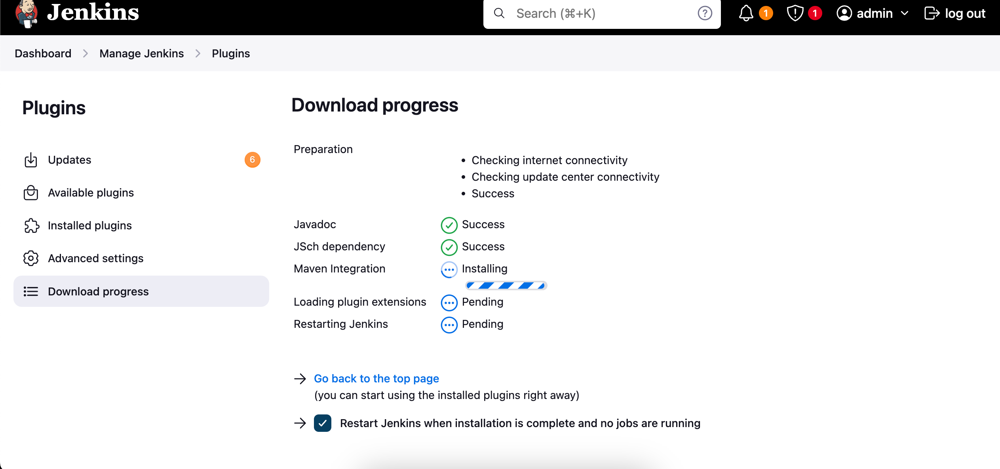

# DEVOPS LAB

### Step 1

[**Dashboard >](http://localhost:8080/) [Manage Jenkins >](http://localhost:8080/manage/) [Plugins](http://localhost:8080/manage/pluginManager/) 
Install the following:**

- [ ]  Maven integration
- [ ]  Eclipse Temurin installerVersion
- [ ]  openJDK-native-plugin
- [ ]  Docker
- [ ]  Docker Pipeline
- [ ]  docker-build-step
- [ ]  CloudBees Docker Build and Publish



### Step 2

[**Dashboard >](http://localhost:8080/) [Manage Jenkins >](http://localhost:8080/manage/) Tools**

Install all the required stuff

For openjdk, use optium

Reference: [https://youtu.be/BePJ1bBWk3E](https://youtu.be/BePJ1bBWk3E)

### Step 3

```markdown

**Check which user Jenkins is running as (usually 'jenkins')**

ps aux | grep jenkins

**Add the Jenkins user to the docker group**

sudo usermod -a -G docker jenkins 

**Restart the Jenkins service to apply the changes**

sudo service jenkins restart 
sudo systemctl restart jenkins / sudo systemctl restart jenkins.service

**Verify the groups for jenkins user**

groups jenkins
```

[https://github.com/jaiswaladi246/docker-spring-boot-java-web-service-example](https://github.com/jaiswaladi246/docker-spring-boot-java-web-service-example)

### Step 4

[http://localhost:8080/manage/credentials/store/system/domain/_/newCredentials](http://localhost:8080/manage/credentials/store/system/domain/_/newCredentials)

add your docker hub username and password, also makes sure you login to your docker hub in docker cli


Create a new item


choose the credentials you saved


you can use a post build step like execute shell to also run the application locally

